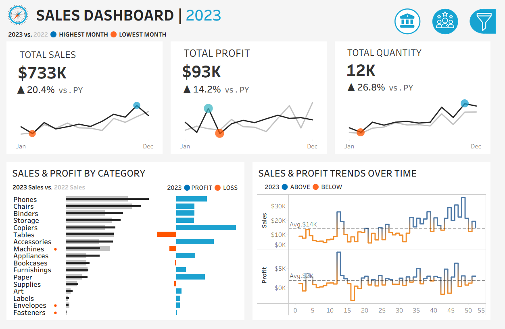

# End-to-End Sales Performance Dashboard (SQL Server + Tableau)

🔗 **Live Interactive Dashboard (Tableau Public)**  
👉 [https://public.tableau.com](https://public.tableau.com/views/End-to-EndSalesPerformanceDashboard/SALESDASHBOARD?:language=en-GB&:sid=&:redirect=auth&:display_count=n&:origin=viz_share_link)

---

## Project Overview

This project delivers an end-to-end Business Intelligence (BI) solution to analyze **sales performance and customer behavior** for a retail business. The solution enables sales managers and executives to track year-over-year performance, identify growth trends, and understand customer purchasing patterns.

The pipeline follows a real-world analytics workflow:

**Raw CSV Data → SQL Server (Staging) → Data Warehouse (Star Schema) → Analytics Views → Tableau Dashboards**

SQL Server is used for data quality validation, transformation, dimensional modeling, and analytics-ready views. Tableau is used to build interactive dashboards for executive reporting and decision support.

---

## User Requirements

### User Story | Sales Performance  
This user story outlines the specifications for building two dashboards using Tableau to help stakeholders, including **sales managers and executives**, analyze sales performance and customer behavior.

---

### Sales Dashboard | Requirements

**Dashboard Purpose**  
Present an overview of sales metrics and trends to analyze year-over-year sales performance and understand business trends.

**Key Requirements**
- **KPI Overview**
  - Total Sales, Total Profit, Total Quantity (Current Year vs Previous Year)
- **Sales Trends**
  - Monthly trends for current and previous year  
  - Highlight highest and lowest performing months
- **Product Subcategory Comparison**
  - Sales performance by sub-category (CY vs PY)  
  - Sales vs Profit comparison
- **Weekly Trends**
  - Weekly Sales and Profit for the current year  
  - Average weekly benchmarks  
  - Highlight weeks above/below average performance

---

### Customer Dashboard | Requirements

**Dashboard Purpose**  
Provide an overview of customer trends and behavior to help marketing teams and management understand customer segments and improve customer satisfaction.

**Key Requirements**
- **KPI Overview**
  - Total Customers, Total Orders, Sales per Customer (CY vs PY)
- **Customer Trends**
  - Monthly customer KPIs for CY vs PY  
  - Highlight highest and lowest months
- **Customer Distribution**
  - Distribution of customers by number of orders
- **Top 10 Customers by Profit**
  - Rank, orders, sales, profit, and last order date

---

### Design & Interactivity Requirements
- Dynamic year selection  
- Easy navigation between dashboards  
- Interactive charts for filtering  
- Filters by:
  - Product (Category, Sub-Category)  
  - Location (Region, State, City)

---
## 📂 Repository Structure

    end-to-end-sales-performance-sql-tableau/
    │
    ├── data/
    │   └── raw/
    │       ├── Customers.csv
    │       ├── Orders.csv
    │       ├── Products.csv
    │       └── Location.csv
    │
    ├── sql/
    │   ├── 01_staging_quality_checks.sql
    │   ├── 02_dw_create_dimensions.sql
    │   ├── 03_dw_create_fact.sql
    │   ├── 04_dw_load_dimensions.sql
    │   ├── 05_dw_load_fact.sql
    │   └── 06_dw_create_analytics_views.sql
    │
    ├── tableau/
    │   ├── data_model.png
    │   ├── dashboard_sales.png
    │   └── dashboard_customers.png
    │
    ├── .gitignore
    └── README.md

---

## SQL Workflow

The SQL layer is organized into modular, production-style stages:

1. **Data Quality Checks**
   - NULL checks, duplicate detection, invalid value validation  
   - Orphan record detection  
   - Date sanity checks and text standardization  

2. **Dimensional Modeling**
   - Star schema design  
   - Fact table: `Fact_Orders`  
   - Dimensions: `dim_Customers`, `dim_Products`, `dim_Location`, `dim_Date`  

3. **Data Transformation & Loading**
   - Deduplication  
   - Standardization (case formatting, trimming)  
   - Surrogate key generation  
   - Business rule application  

4. **Analytics Views**
   - Pre-aggregated KPI views  
   - Monthly, weekly, product, and customer-level analytical views optimized for Tableau consumption  

This layered SQL design improves **data reliability, reusability, and BI performance**, reflecting real-world analytics engineering practices.

---

## Chart Selection Rationale

- **KPI Cards:** Executive-friendly summary of performance at a glance.
- **Line Charts (Monthly Trends):** Best suited for time-series comparison (YoY analysis).
- **Bar Charts (Sub-Category Performance):** Clear comparison across categories and profit vs loss.
- **Weekly Trend Lines with Reference Line:** Highlights volatility and deviations from average performance.
- **Distribution Bar Chart:** Visualizes customer loyalty and engagement by order frequency.
- **Ranked Table:** Effective for Top 10 customer profitability analysis with supporting attributes.

---

## 📖 Dashboards Overview

The Tableau solution consists of two main dashboards:

### 📈 Sales Performance Dashboard
- YoY Sales, Profit, Quantity KPIs  
- Monthly trends with best/worst month indicators  
- Weekly performance vs average benchmarks  
- Product sub-category sales and profitability comparison  

### 👥 Customer Analytics Dashboard
- Customer KPIs (Customers, Orders, Sales per Customer)  
- Customer distribution by order frequency  
- Top 10 customers by profit with detailed attributes  

---

## 📊 Dashboard Preview

### 📈 Sales Performance Dashboard

---

### 👥 Customer Analytics Dashboard

---

> 📌 For full interactivity, filters, and drill-downs, explore the live dashboard on Tableau Public:  
> 👉 [https://public.tableau.com](https://public.tableau.com/views/End-to-EndSalesPerformanceDashboard/SALESDASHBOARD?:language=en-GB&:sid=&:redirect=auth&:display_count=n&:origin=viz_share_link)

---

## Data Sources

The project uses a retail transactional dataset consisting of:

- Customers  
- Orders  
- Products  
- Location  

All datasets are ingested into SQL Server and transformed into a dimensional warehouse model before being consumed by Tableau.

---

## Insights & Recommendations

Key analytical takeaways from the dashboards include:

- Certain product sub-categories generate high sales but low profit margins, indicating pricing or discount strategy improvement opportunities.  
- Clear seasonality is observed in monthly sales trends, suggesting targeted promotions during low-performing months.  
- Weekly sales volatility highlights operational or promotional inconsistencies that require further investigation.  
- A small group of high-value customers contributes a significant share of total profit, indicating both retention opportunities and concentration risk.

---

## 🛠️ Tools & Technologies
- **[SQL Server Express](https://www.microsoft.com/en-us/sql-server/sql-server-downloads):** Data validation, transformation, dimensional modeling, analytics views
- **[SQL Server Management Studio (SSMS)](https://learn.microsoft.com/en-us/sql/ssms/download-sql-server-management-studio-ssms?view=sql-server-ver16):** Database management and querying
- **[Tableau Public](https://public.tableau.com/app/profile/rasheed.shaik4381/vizzes):** Interactive dashboards and data visualization
- **[Git & GitHub](https://github.com/):** Version control, documentation, project sharing
- **[DrawIO](https://www.drawio.com/):** Data model and architecture diagram design
---

## Author

**RASHEED SHAIK**  
Aspiring Data Analyst | SQL | Tableau | Data Warehousing | Data Storytelling  

---

## License

This project is licensed under the MIT License. You are free to use, modify, and share this project with proper attribution.

